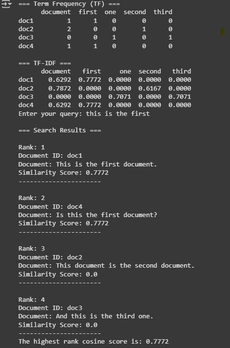

### EX6 Information Retrieval Using Vector Space Model in Python
### NAME: Narendran K
### DATE: 25.09.2025
### AIM: To implement Information Retrieval Using Vector Space Model in Python.
### Description: 
<div align = "justify">
Implementing Information Retrieval using the Vector Space Model in Python involves several steps, including preprocessing text data, constructing a term-document matrix, 
calculating TF-IDF scores, and performing similarity calculations between queries and documents. Below is a basic example using Python and libraries like nltk and 
sklearn to demonstrate Information Retrieval using the Vector Space Model.

### Procedure:
1. Define sample documents.
2. Preprocess text data by tokenizing, removing stopwords, and punctuation.
3. Construct a TF-IDF matrix using TfidfVectorizer from sklearn.
4. Define a search function that calculates cosine similarity between a query and documents based on the TF-IDF matrix.
5. Execute a sample query and display the search results along with similarity scores.

### Program:
```
    from sklearn.feature_extraction.text import TfidfVectorizer, CountVectorizer
from sklearn.metrics.pairwise import cosine_similarity
import pandas as pd
import string

# Sample documents
documents = {
    "doc1": "This is the first document.",
    "doc2": "This document is the second document.",
    "doc3": "And this is the third one.",
    "doc4": "Is this the first document?",
}

# Minimal stopwords list
stop_words = set([
    "is", "a", "the", "this", "and", "with", "for", "of", "on", "in", "to"
])

# Preprocessing function
def preprocess_text(text):
    text = text.lower()
    text = text.translate(str.maketrans('', '', string.punctuation))
    tokens = [word for word in text.split() if word not in stop_words]
    return " ".join(tokens)

# Preprocess documents
preprocessed_docs = {doc_id: preprocess_text(doc) for doc_id, doc in documents.items()}

# Display Term Frequency (TF)
count_vectorizer = CountVectorizer()
tf_matrix = count_vectorizer.fit_transform(preprocessed_docs.values())
tf_df = pd.DataFrame(tf_matrix.toarray(), index=preprocessed_docs.keys(), columns=count_vectorizer.get_feature_names_out())
print("=== Term Frequency (TF) ===")
print(tf_df)

# Display TF-IDF
tfidf_vectorizer = TfidfVectorizer()
tfidf_matrix = tfidf_vectorizer.fit_transform(preprocessed_docs.values())
tfidf_df = pd.DataFrame(tfidf_matrix.toarray(), index=preprocessed_docs.keys(), columns=tfidf_vectorizer.get_feature_names_out())
print("\n=== TF-IDF ===")
print(tfidf_df.round(4))

# Search function using cosine similarity
def search(query, tfidf_matrix, tfidf_vectorizer):
    preprocessed_query = preprocess_text(query)
    query_vec = tfidf_vectorizer.transform([preprocessed_query])
    cosine_sim = cosine_similarity(query_vec, tfidf_matrix).flatten()

    results = []
    doc_ids = list(preprocessed_docs.keys())
    for i, score in enumerate(cosine_sim):
        results.append((doc_ids[i], documents[doc_ids[i]], score))

    # Sort by score descending
    results.sort(key=lambda x: x[2], reverse=True)
    return results

# User query
query = input("Enter your query: ")

# Perform search
search_results = search(query, tfidf_matrix, tfidf_vectorizer)

# Display search results
print("\n=== Search Results ===")
for i, result in enumerate(search_results, start=1):
    print(f"\nRank: {i}")
    print("Document ID:", result[0])
    print("Document:", result[1])
    print("Similarity Score:", round(result[2], 4))
    print("----------------------")

# Highest cosine score
highest_rank_score = max(result[2] for result in search_results)
print("The highest rank cosine score is:", round(highest_rank_score, 4))

```
### Output:



### Result:
Thus the code to implement Information Retrieval Using Vector Space Model in Python is executed successfully